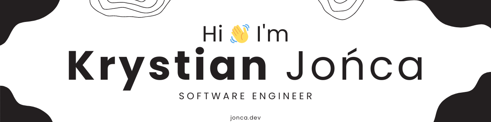

# About me 👨‍💻

- 👋 Hi, I’m @KrystianJonca. I am an 18 year old, hardworking and passionate developer, based in Poland.
- 👀 Programming since 12.
- 🌱 Learning new things and improving every day.
- 💞️ I’m looking to collaborate on any JavaScript project.
- 🚀 Available for hire.
- 📫 You can contact me here: krystianjonca17@gmail.com.

# Let's connect 🙌

# Tech Stack & Tools 💻

# GitHub Stats 📝

 

# Some Of My Projects 📏
&nbsp;&nbsp;
&nbsp;&nbsp;

&nbsp;&nbsp;
&nbsp;&nbsp;

&nbsp;&nbsp;
&nbsp;&nbsp;

&nbsp;&nbsp;
&nbsp;&nbsp;

<!--
**KrystianJonca/KrystianJonca** is a ✨ _special_ ✨ repository because its `README.md` (this file) appears on your GitHub profile.

Here are some ideas to get you started:

- 🔭 I’m currently working on ...
- 🌱 I’m currently learning ...
- 👯 I’m looking to collaborate on ...
- 🤔 I’m looking for help with ...
- 💬 Ask me about ...
- 📫 How to reach me: ...
- 😄 Pronouns: ...
- ⚡ Fun fact: ...
-->
